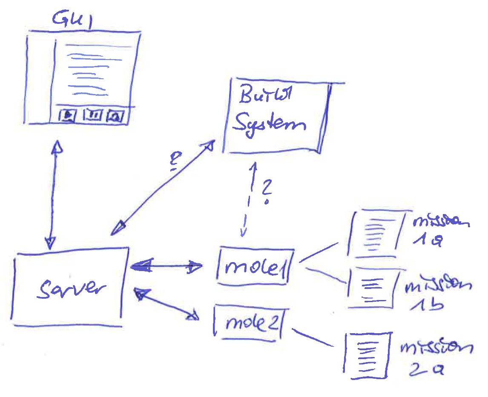

# Concepts and Vision
The purpose of this document is mainly to lay out a common vision and concepts which are implemented (or shall be implemented) in the molr project.

## The Name
The name *molr* was a result of discussion where we found that a good name for some part of our big system which would execute pieces of functionality would be an "Agent". However, we also found that this term was already too much overloaded. Further we thought that our at-that-time agents would work very often in the dark and unnoticed... and since as the reader of any good action thrillers knows: Such agents are called **moles** (although usually with a negative association, while our moles are of course good guys ;-). Those moles usually execute **missions** and they get their instructions by **agencies**.
So to conclude: this project is all about small moles, it provides of modularity (it is mo(du)l(a)r) and *molar* also associates a bit with molecules working together - which could be another way how to see the thing ;-) ... Making a long thing short: *molr* is what came out ;-)

## Purpose
Molr shall make it simple to create modular systems, where it has to be possible to exchange (deploy) parts of them at runtime (This parts are called *mole*s in the following). While this requirement can be seen common to standard microservice architectures, there are several key features that molr shall provide in addition:

* The moles are related to one mother-system, which typically is a service for a dedicated purpose (If we think of examples in the cern acclerator environment, then the mother-system could e.g. the sequencer and the moles would be sequencer agents). The moles provide certain snippets of functionality (denoted as *missions* in the following) to the mother system.
* The moles provide functionality to execute the missions in different modes. At a minimum, we see: "run them", "step through them".
* Ideally, the mole can be deployed through the mother system, so tha only one entry point is required and coupling to other technologies can be minimized (and/or encapsulated)

The following picture shows an overview of an example system using molr:

## Components and Responsibilities

### Agency
(This is a proposed name, I think we did not call anything like this yet). The Agency is the central place which controls all the actions and tells its associated moles what to do. Usually, the agency is embedded in a server. A user can interact with the agency through a GUI to control the moles and their missions.

### Mole
The mole is the entry point of each independably deployable unit, which is able to execute a certain set of missions. Each mole has to have (at least) two modes of execution:
* **run** a mission,
* and **step through** a mission.
On deployment (=startup?) time, the mole has to report the missions he is prepared to execute to the agency, so that the agency can run/step them. Each mole also might need some way to find out what missions he has available in its deployment unit (e.g. scan the classpath, or just have it hardcoded somehow)

Mole implementations might have two dimensions of specializations: The supported programming language, and some type of mission he is able to execute. For example, we could imagine moles like:
* JavaRunnableMole: I could simply have a certain set of java runnables available, which he can execute on request. (The mission name could e.g. simply the classname)
* JavaJunitMole: It could hava set of java junit classes which it can execute on request. Here probably a notion of submissions (or the other way around: A MissionSet) could be interesting, because sometimes it might be useful to execute a full Junit test class, some other times only a test method.
* PythonCallableMole: Could have available a set of callables which it can execute on request.
* PythonPyunitMole: ... similar to JavaJunitMole
* ...

It might be usefult to have the possibility to write the moles itself in different languages. Therefore a communication protocol between agencies and moles have to be chosen which has bindings to a variety of languages.

### Mission
A mission is the piece which contains the actual logic to execute. E.g. for a java mole this should be plain java code that could be run (or stepped through). The mole has to have the possibility to observe the state of the mission and finally get a result from it (e.g. IN_PROGRESS, FAILED, SUCCESSFUL, ERROR).

### Molar GUI
This should allow the user to step through a certain mission.
(probably also - for debugging - functionalities like listing the available missions and running a selected mission could be useful. However, for a production client it might be more often the case that a client asks for running a fixed (hardcoded) mission, and just needs the gui in the case the user wants to explicitely step through it)

### Deployment system (plugin)
There has to be a way from a build system to deploy new (versions) of moles. This could either be achieved through the agency itself (which then itself could use some well established deployment strategy/technology (e.g. docker images)), could be done through the back door through some other technology itself. tbd.
